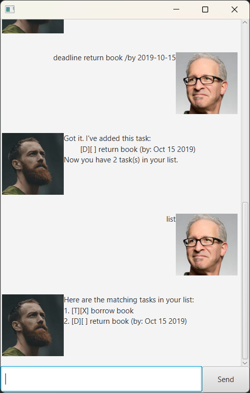

# Zoe User Guide

This project introduces a smart, conversational chatbot that functions as a fully interactive to-do list app. Instead of navigating traditional task management interfaces, users simply chat with the bot to organize their day, set reminders, and track task progress.

## Command Overview

The chatbot supports several commands to manage tasks:
- `todo` - Add a basic task.
- `deadline` - Add a task with a specific due date.
- `event` - Add a task with a specific date and time.
- `list` - View all tasks.
- `delete` - Remove a task from the list.
- `mark` - Mark a task as done.
- `unmark` - Mark a task as not done.
- `find` - Search for tasks containing specific keywords.
- `bye` - Exit the chatbot.

## Adding a Todo Task

The todo command allows users to add a simple task without any time constraints.

Command Format:
`todo <task_name>`
- `<task_name>`: The name or description of the task.

Example: `todo buy groceries`

Expected Outcome:
- The chatbot adds the task "buy groceries."
- A confirmation message is displayed, including the task details and the total number of tasks in the list.

## Adding deadlines

The deadline command allows users to add a task with a specific due date to their task list. This helps manage time-sensitive tasks effectively.

Command Format:
`deadline <task_name> /by <yyyy-MM-dd>`
- `<task_name>`: The name or description of the task.
- `<yyyy-MM-dd>`: The due date in the format Year-Month-Day.

Example: `deadline return book /by 2019-10-15`

Expected outcome:
- The chatbot adds the task "return book" with the deadline set to October 15, 2019.
- The task is saved to storage, ensuring it persists across sessions.
- A confirmation message is displayed, including the task details and the total number of tasks in the list.

## Adding Events

The event command allows users to add a task scheduled for a specific date and time.

Command Format:
`event <task_name> /from <yyyy-MM-dd> /to <yyyy-MM-dd>`

- `<task_name>`: The name or description of the task.
- `<yyyy-MM-dd>`: The date of the event (from, to).

Example:

`event project meeting /from 2023-06-25 /to 2023-06-26`

Expected Outcome:
- The chatbot adds the task "project meeting" scheduled for June 25, 2023.
- The task is saved to storage.
- A confirmation message is displayed, including the task details and the total number of tasks in the list.

## Finding Tasks

The find command allows users to search for tasks containing specific keywords.

Command Format:
`find <keyword>`
- `<keyword>`: The keyword to search for in task names or descriptions.

Example: `find book`

Expected Outcome:
- The chatbot displays all tasks containing the keyword "book."